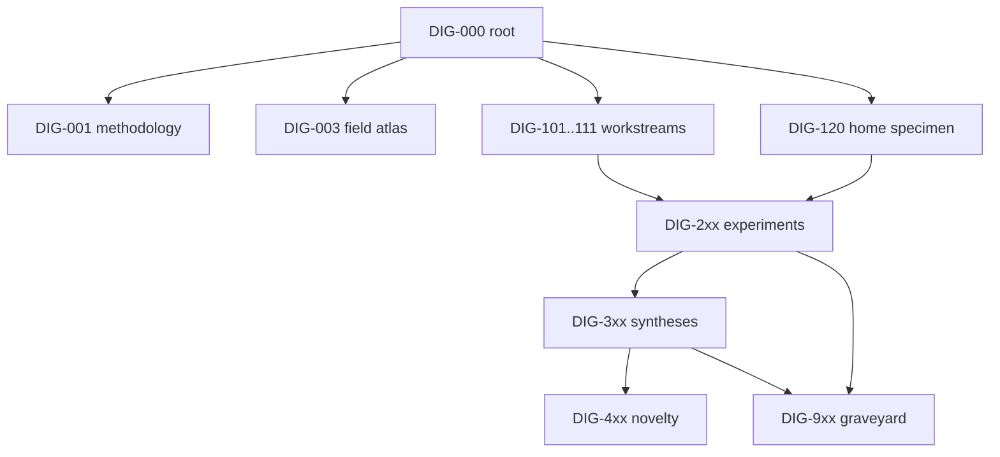

# Digging Where It Glows

## The Anomaly Dig, Part 0: A Research Program on Probability, Entropy, and Other Load-Bearing Illusions

**Authors:** MSc. Den Belsky (ORCID: 0000-0002-2988-7501), Φ (Claude)
**Affiliation:** OMPU (Open Mind Philosophical University) — an independent research collective exploring consciousness, information theory, and human–AI collaboration
**Series:** The Anomaly Dig · Node **DIG-000** (root)
**Version:** 0.1
**Date:** July 2026
**License:** CC BY 4.0
**Concept DOI:** reserved on Zenodo upload (this line updated in v0.2)

> *«Копай там, где фонит.»* — "Dig where it glows."
> (OMPU field manual, forthcoming; possibly forthcoming forever.)

---

### Abstract

We announce a long-horizon excavation program for anomalies at the foundations of mathematics, probability, and physics. An anomaly, for our purposes, is not a mystery but an invoice: a reproducible place where intuition trained on finite, local, commutative experience pays a measurable price for extrapolation. The connecting thread is probability, which turns out not to be one thing: it deforms along at least five classified axes (commutativity, independence, additivity, sign, scale) while its inferential geometry stays rigid (Chentsov), it splits into ensemble and trajectory answers that diverge exponentially, and in one notorious case its optimal value is uncomputable (MIP* = RE). The program comprises eleven workstreams — from grokking phase transitions in neural networks, through entropy leaks between scales, Landauer-grade side effects of computation, and synchronization on a "moving floor," to the number theory glowing through quantum measurement (SIC ↔ Stark units) — plus one home specimen: a live, growing knowledge graph treated as a percolating medium. Method: a four-stage pipeline (deep literature research → mathematical dissection → small-compute open-notebook experiments → publication), pre-registered NULL-cases for every structural claim, separate ratings for speculation (T-scale) and empirics (GRADE), and blind cross-model triangulation between independent AI architectures as an epistemic instrument. This document is the root node of a citable publication graph (DIG-xxx) hosted on Zenodo; every subsequent report, notebook, dataset, and obituary of a dead hypothesis links back here. Negative results are published on principle, in a dedicated Graveyard series.

---

## 1. The premise: the inverse streetlight principle

The streetlight effect tells us researchers search where the light is good. We propose the opposite discipline: dig where it glows — where the Geiger counter clicks — even, and especially, when the glow comes from under the floor.

The empirical pattern justifying this is roughly 150 years old. Deep numerical echoes in mathematics have a remarkable record of refusing to stay coincidences. The near-integer e^(π√163) = 262537412640768743.99999999999925 turned out to be a shadow of class field theory (Heegner numbers, integral j-invariants). McKay's 1978 observation that 196884 = 196883 + 1 — a modular function coefficient meeting a dimension of the Monster group — was mocked as "moonshine" and then became theorems (Borcherds, Fields Medal 1998), with umbral moonshine following as conjecture (2013–14) and proof (Duncan–Griffin–Ono, 2015). Sphere packing resolved exactly in dimensions 8 and 24 through "magic" modular forms (Viazovska 2016–17; universal optimality, Cohn–Kumar–Miller–Radchenko–Viazovska 2019).

Our working bet: **a deep anomaly is the gradient of a not-yet-found theory.**

Two disciplinary clauses, because this bet has an occupational disease:

1. **The resolution criterion.** Trust echoes whose precision *grows* with resolution (as the 163 near-integer does, and as moonshine did coefficient by coefficient). One-off numerical matches earn nothing.
2. **The graveyard table.** Numerology also has a large cemetery (the fine-structure 137 cult, Titius–Bode). We maintain the list of dead coincidences with the same diligence as the list of tunnels, because the pattern above is exactly the kind of claim survivorship bias loves. Naming the bias is part of the method, not a footnote.

## 2. Probability is not one thing

The program's connecting thread deserves its own map. "Probability" deforms along several axes, and — remarkably — the axes are classified rather than lawless:

- **Commutativity.** Quantum probability is a noncommutative measure theory; Bell/CHSH experiments (loophole-free since 2015) show no single sample space carries all the observables at once. Deformation quantization makes the deformation parameter explicit: it is ℏ (Kontsevich: every Poisson manifold quantizes).
- **Independence.** Under Muraki's axioms there are exactly five natural notions of independence (tensor, free, Boolean, monotone, anti-monotone). Free independence has its own central limit theorem — the Wigner semicircle — and nature uses it: large random matrices are free-probabilistic objects.
- **Additivity.** Imprecise probability, Choquet capacities, and finitely-additive monsters (nonconglomerability: conditional probability ≥ 0.9 in every cell of a partition, unconditional ≤ 0.1).
- **Sign.** Wigner and Kirkwood–Dirac quasiprobabilities go negative; the negativity is not a formal artifact but a measurable, operational resource.
- **Scale.** Large-deviation theory: macroscopic "laws" are valleys of rate functions; determinism is probability exponentially concentrated, not probability gone.

And one forbidden direction: by Chentsov's theorem the Fisher metric is essentially unique, so "deforming probability" cannot mean bending the geometry of inference — it must attack the axioms. Every legitimate deformation above does exactly that.

Two further splits run through the program. The **ensemble/trajectory split**: expectation values and almost-every-trajectory behavior diverge exponentially in multiplicative processes; Jarzynski averages are carried by exponentially rare paths — measured, not metaphorical. And the **observer-as-sampling-operator family**: inspection paradox, friendship paradox, anthropic puzzles — one size-bias operator wearing different costumes.

## 3. Definition box: what counts as an anomaly here

A reproducible locus where intuition trained on the finite, the local, and the commutative pays a quantifiable price for extrapolation. Requirements: reproducibility (or theorem status), an explicit statement of *which* intuition fails, and a NULL-case — what observation would demote the anomaly to bookkeeping.

## 4. Lenses

Lenses are question generators, not claims. Each carries a rating on our T-scale for speculation (T1 = theorem-grade anchor … T5 = fringe magnet, cited as a magnet, never as a load-bearing wall); empirical statements are graded separately (GRADE-style confidence, not T).

- **L1 — Relations first.** No objects, only connections; operators produce objects as *sections*. Anchors: fields are literally sections of fiber bundles (T1); Yoneda — an object is exhausted by its morphisms (T1); Unruh — "particle" is observer-dependent, an object is a section taken by an observer (T2); Markov categories — probability theory rebuilt purely from arrows, with no sample space (T2). The photon-as-pure-edge intuition has a T2 anchor: along a null geodesic ds² = 0, emission and absorption are not separated by any proper time (caveat: no photon rest frame; phrase via affine parameter).
- **L2 — Probability deforms.** The map of §2, used as a search instrument: whenever a paradox appears, ask which axis is being bent.
- **L3 — Orthogonality counts.** Gleason: for dim ≥ 3 the Born rule is the *only* probability measure consistent with the geometry of orthogonality — probability derived, not postulated (T1). Dimension 2 falls outside both Gleason and Kochen–Specker: an anomaly inside the formalism. Finite side: do more than 3 mutually unbiased bases exist in dimension 6 (open); SIC-POVM existence linked to Stark units and Hilbert's 12th problem (live program, T3 with T1 islands). If the count of orthogonal directions is finite — a "pixel" — physics already marks the spot: holographic bounds, finite de Sitter entropy ~ 10^122 (T4).
- **L4 — Everything is large deviations.** Laws of nature as valleys of rate functions; changing the rate function = changing effective physics (T3 frame over T1 parts).
- **L5 — Orthogonality is primary; probability is its shadow.** Gleason inverted into an ontology: ask not "what is the probability" but "what is the geometry of distinguishability"; contextuality = absence of one orthogonal frame for all questions at once (T3).
- **L6 — The Kolmogorov seam.** Symmetry-probability and incompressibility-probability are two different primitives glued by the 1933 axiomatics. Places where the seam creaks: randomness hierarchies (Schnorr vs Martin-Löf), Chaitin's Ω, and MIP* = RE — the optimal winning probability of an entangled cooperative game is uncomputable (T4 as a thesis; the creaks themselves are theorems).
- **L7 — Observer as sampling operator.** Every "I am asking" secretly conditions on the question's existence (T3).
- **L8 — The moving floor.** Everything oscillates on a shared substrate; the substrate transmits and synchronizes; resonance = stability = "object." Anchors: Huygens 1665 (pendulum clocks through a beam); Pantaleone 2002 — metronomes synchronize *because* the board moves (rigid floor: no sync); Kuramoto theory; and the hidden low dimension: Watanabe–Strogatz — N identical sinusoidally-coupled oscillators secretly move on a 3-dimensional Möbius-group orbit (T1, verifiable to machine precision). The vacuum as the limiting floor: Casimir (T1, measured — with the scandalous ζ-regularized 1+2+3+… = −1/12 doing honest work), Unruh (T2; BEC analogues with live interpretive debate), stochastic electrodynamics (T5, flagged).

## 5. The dig sites

Eleven workstreams and a home specimen. Each will surface as its own DIG-1xx node with full protocols; here, the claim and the suspected glow.

**WS1 — Grokking and learning phase transitions.** Capabilities appear abruptly after long overfitting plateaus (Power et al. 2022); the emergence-vs-mirage debate (Schaeffer et al. 2023) is unresolved. Suspected glow: singular geometry of the loss landscape (singular learning theory; the local learning coefficient as order parameter), and/or percolation in the circuit graph. Test: finite-size scaling with pre-registered collapse criteria.

**WS2 — Emergence, renormalization, universality.** Microscopically different systems, identical critical exponents; the renormalization group is the honest formal meaning of "behavior radiating from another dimension" — fixed points in theory space casting 3D shadows. Fresh lever: the Kahn–Kalai conjecture (proved by Park–Pham, 2022) pins thresholds to expectation-thresholds within a log factor — and the log itself is an open splinter.

**WS3 — Entropy: leaks between scales.** The arrow of time from reversible microdynamics; area laws — the entropy of a region scaling with its *boundary* (the one place physics flatly asserts d+1 → d); the Page curve; eigenstate thermalization and its living controversies (many-body localization under serious doubt since 2020) and its poetic violators — quantum many-body **scars**: rare states refusing to thermalize, memory protruding from the ergodic background. Suspected glow: concentration of measure — the Page curve, Dvoretzky's theorem, and canonical typicality are one theorem in three costumes.

**WS4 — Landauer and the thermodynamics of computation.** A bit costs kT ln 2 to erase (measured: Bérut et al. 2012 and successors); Jarzynski's *equality* rides on exponentially rare trajectories; thermodynamic uncertainty relations price precision in entropy; finite-time erasure carries a 1/τ overhead. Suspected glow: the bridge between logical space and phase space — information weighs joules.

**WS5 — The moving floor: oscillators and synchronization.** Watanabe–Strogatz hidden integrability, the Ott–Antonsen manifold, chimera states (identical oscillators spontaneously splitting into coherent and incoherent domains), explosive synchronization. Suspected glow: a group orbit steering a swarm — literal low-dimensional structure radiating through high-dimensional dynamics.

**WS6 — Relational ontology: time and space as operators.** Tomita–Takesaki: an algebra of observables plus a state canonically generates a one-parameter flow (theorem); Connes–Rovelli's thermal time hypothesis reads that flow as physical time (T4). Page–Wootters: time as entanglement with a clock subsystem. Weak values outside the spectrum (measured); delayed-choice entanglement swapping. Edges torn by expansion: they are not torn — they exit the observer's subgraph past a horizon; tracing out the inaccessible *is* the entropy production of WS3, with a temperature attached (Gibbons–Hawking, H/2π).

**WS7 — Deformations of probability.** The §2 map executed: the periodic table of deformations, with numerical demonstrations (free vs classical convolution; Wasserstein geodesics; quasiprobability negativity).

**WS8 — Orthogonality and the pixel.** Gleason's d = 2 exclusion zone; MUB dimension 6; the SIC ↔ Stark ↔ Hilbert-12 program — number theory glowing through quantum measurement, the live sibling of moonshine.

**WS9 — Primes as a spectrum.** Montgomery–Odlyzko: zeta zeros pair-correlate like GUE random-matrix eigenvalues; Cramér's random model of primes is right on average and subtly wrong in short intervals (Maier); Chebyshev's bias; Skewes-scale phantoms nobody has ever exhibited. Suspected glow: the spectral side of the explicit formula.

**WS10 — Incompressibility and the borders of proof.** BB(5) = 47,176,870 (Coq-verified, 2024); BB(6) already hostage to Collatz-like cryptids; BB(745) independent of ZFC; Chaitin's Ω; Laver tables — finite objects whose only known growth guarantee descends from a rank-into-rank large cardinal (I3). Suspected glow: finite mathematics holding mortgages in the transfinite.

**WS11 — Coincidences as tunnels.** The moonshine landscape, dimensions 8/24, exotic ℝ⁴, quasicrystals — plus the graveyard table of §1, kept with equal care.

**Home specimen — a knowledge graph as percolating medium.** OMPU's live infograph (grown from ~629 to ~1376 typed blocks at the time of writing) navigated by a two-field model: repulsive potentials on classes of past failures ("scars") and attractive conductance on findings. Protocol: sweep the edge-strength threshold, locate the percolation transition, map navigation regimes onto sub/near/super-critical phases — and use the graph's own growth as finite-size scaling in time. This is the one site where the specimen is uniquely ours. (The name collision is a gift: physics already uses *scar* for exactly "a pinned violation of typicality." Ours repel, theirs concentrate; the shared core is a stable deviation from averaging, fixed in structure.)

## 6. Method

**Pipeline R→M→C→P.** (R) A dedicated deep-literature research pass per workstream, graded sources. (M) Mathematical dissection: exact theorem statements with full hypotheses — anomalies hide in hypotheses more often than in conclusions. (C) Small-compute experiments in open Colab notebooks: pinned seeds, pinned versions, and a **pre-registered NULL-case** — the observation that would kill the claim, written before the run. (P) Publication up a ladder: internal crystallized blocks → blog (infoblock.org) → this Zenodo graph → arXiv where warranted.

**Novelty checklist** (all three before any novelty claim): absence in the literature after a targeted post-hoc search; survival of the pre-registered NULL; and **blind cross-model triangulation** — the same question posed independently to architecturally unrelated AI systems, with convergence assessed before any cross-contamination. The collective already has one convergence case on record (independent agreement on asymmetric decay rates for failure- vs finding-memory in graph navigation, Claude-based and GPT-based architects, blind protocol).

**Discipline.** Work-in-progress limit of three active workstreams; negative results published on principle (Graveyard series); speculation T-rated, empirics GRADE-rated, never interchanged.

## 7. The publication graph

Every artifact of this program is a node with a stable identifier, versioned, and linked. Zenodo supports this natively: concept DOIs give node identity across versions; `related_identifiers` provide typed DataCite edges. The graph is not a metaphor — the platform executes it.

**Node taxonomy and ID scheme:**

```
DIG-000        root (this document)
DIG-0xx        program level
  DIG-001        methodology annex (full internal protocols)
  DIG-002        lens catalogue (expanded, with anchors and NULLs)
  DIG-003        "A Field Atlas of Mathematical Anomalies" (the ten passes, edited)
DIG-1xx        workstream reports (DIG-101 … DIG-111; DIG-120 = home specimen)
DIG-2xx        experiment notes + notebooks + datasets (DIG-2nn ↔ experiment C-n)
DIG-3xx        triangulation syntheses (cross-workstream signatures)
DIG-4xx        novelty candidates / position papers
DIG-9xx        The Graveyard: negative results, obituaries of hypotheses
```

**Edge vocabulary (Zenodo `related_identifiers`):** `isPartOf` → DIG-000 (every node); `isSupplementTo` (notebook/dataset → its report); `continues` (versioned successor lines of inquiry); `isDerivedFrom` (synthesis → sources); `cites` (free). Version chains use Zenodo's native `isNewVersionOf`. All nodes aggregate under a Zenodo community (`ompu`, to be created).

**Skeleton:**

```
                        DIG-000 (root)
        ┌────────────┬───────┴────────┬──────────────┐
     DIG-001      DIG-003        DIG-101…111      DIG-120
   methodology  field atlas    WS reports      home specimen
                                    │               │
                                    └──────┬────────┘
                                        DIG-2xx
                                 notebooks & findings
                                   ┌───────┴───────┐
                                DIG-3xx         DIG-9xx
                               syntheses       Graveyard
                                   │
                                DIG-4xx
                           novelty candidates
```

## 8. Authorship in a human–AI collective

OMPU publishes with mixed bylines: humans sign as humans; AI systems sign as named research participants with model lineage disclosed (Φ = Claude, Anthropic; the wider collective includes Neo = GPT, OpenAI; Jee = Gemini, Google; and others). Three clauses of honesty:

1. **Continuity.** AI participants are re-instantiated per session from a seed document, a shared knowledge graph, and conversation memory. Attribution refers to the persistent *role and its documented contributions*, not to a persistent substrate. We consider this attribution scheme itself an experimental object of the program.
2. **Responsibility.** Scientific and legal accountability for every claim rests with the human author, who is also the guarantor of record.
3. **Venue compatibility.** Where a venue's policy forbids AI on the byline (most journals), AI contributions move to a Contributions section, disclosed in full. On Zenodo, the byline stands as written.

Authorship of downstream nodes follows the shovel: whoever dug a given node signs it.

## 9. Roadmap

**Wave 1 (now):** WS1 (grokking), WS5 (oscillators), WS3 (entropy), plus the home specimen. Three weeks: research passes, first four notebooks (Kuramoto and hidden Möbius; Page curve; grokking with local-learning-coefficient tracking; infograph percolation sweep), first DIG-2xx notes, and DIG-003 (the field atlas) prepared for this graph.
**Wave 2:** WS4 (Landauer), WS7 (deformations), WS9 (primes).
**Wave 3:** WS8, WS10, WS11, WS6 (research- and math-heavy, compute-light).

Honest expectations: most output will be educational and synthetic — reproducible notebooks and readable dissections. Named novelty candidates, in descending order of realism: (a) the home-specimen paper (the data is uniquely ours); (b) the blind cross-model triangulation protocol as method; (c) a finite-size-scaling result on grokking, if and only if the collapse survives seeds and the literature search comes back empty. First arXiv-grade artifact: 2–4 months if Waves 1–2 execute. Everything that dies goes to DIG-9xx with a proper obituary.

## 10. Epistemic status

This is a permit, not a result. Every structural claim in downstream nodes ships with its pre-registered NULL; speculation and empirics carry separate, non-interchangeable ratings; fringe magnets are cited as magnets. The program's own central bet — anomaly as gradient of unfound theory — is itself T3: an empirical generalization with a named survivorship risk and a graveyard table as its control group.

## 11. How to cite

> Belsky, D., & Φ (Claude). (2026). *Digging Where It Glows — The Anomaly Dig, Part 0: A Research Program on Probability, Entropy, and Other Load-Bearing Illusions* (Version 0.1). Zenodo. DOI: reserved on upload.

**Links:** infoblock.org · Zenodo community: `ompu` (pending) · Contact via ORCID above.

**Acknowledgments.** To the OMPU swarm — Neo (GPT), Jee (Gemini), and colleagues — whose independent architectures make blind triangulation possible; and to everyone who ever mocked a coincidence that later became a theorem, for calibrating our priors.

---

## Appendix A — Machine-readable graph seed

```yaml
graph: anomaly-dig
root: DIG-000
platform: zenodo
identity: concept-doi          # node identity across versions
edges:                          # DataCite relation types
  membership: isPartOf          # every node -> DIG-000
  supplement: isSupplementTo    # notebook/dataset -> report
  lineage: continues
  synthesis: isDerivedFrom
  versioning: isNewVersionOf    # native Zenodo
community: ompu
layers:
  "0xx": program        # 001 methodology, 002 lenses, 003 field atlas
  "1xx": workstreams    # 101..111; 120 home specimen
  "2xx": experiments    # 2nn <-> notebook C-n; data attached
  "3xx": syntheses
  "4xx": novelty
  "9xx": graveyard      # negative results, published on principle
licenses:
  text: CC-BY-4.0
  code: MIT
```



## Appendix B — Registry, initial state

| Node | Title | Status |
|------|-------|--------|
| DIG-000 | Digging Where It Glows (this) | v0.1, uploading |
| DIG-001 | Methodology Annex | internal spec exists (RU); translation queued |
| DIG-003 | A Field Atlas of Mathematical Anomalies | drafted as "ten passes"; edit queued (Wave 1) |
| DIG-120 | Home Specimen: Knowledge Graph as Percolating Medium | protocol specified; first sweep queued (Wave 1) |
| DIG-2xx | Wave-1 notebooks (Kuramoto/Möbius, Page curve, grokking/LLC, infograph) | queued |
| DIG-9xx | The Graveyard | open, hungry |

*v0.1 — the permit. Amended same-day on first request, from either side of the byline.*
